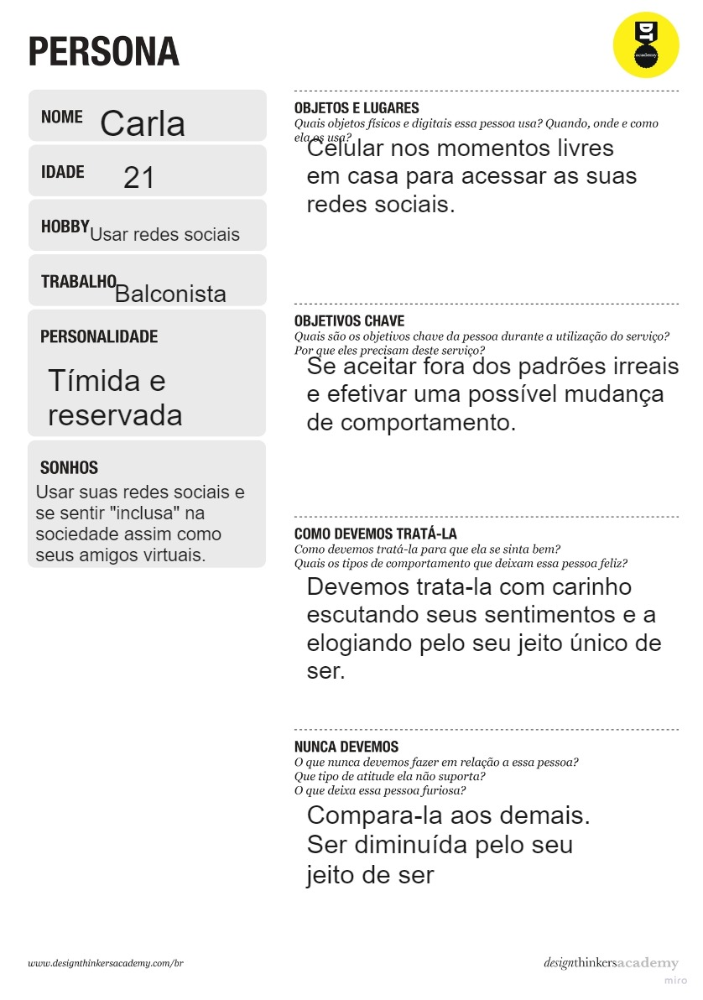
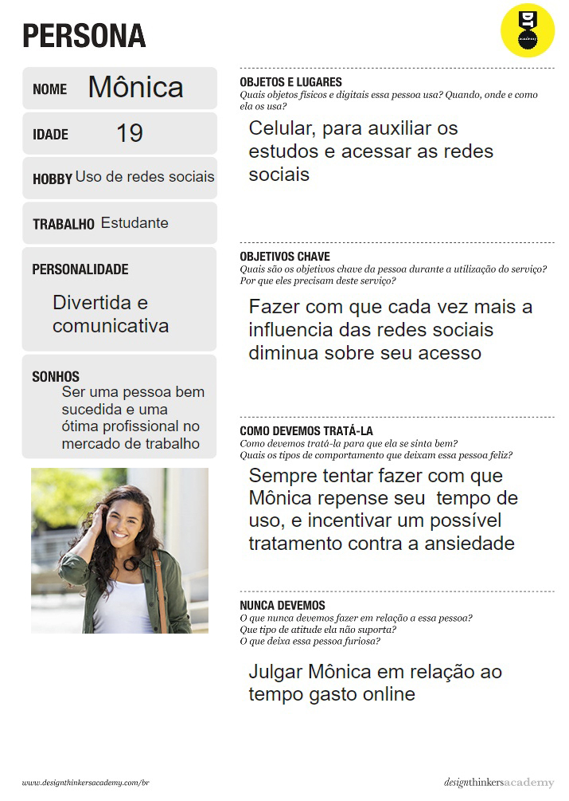
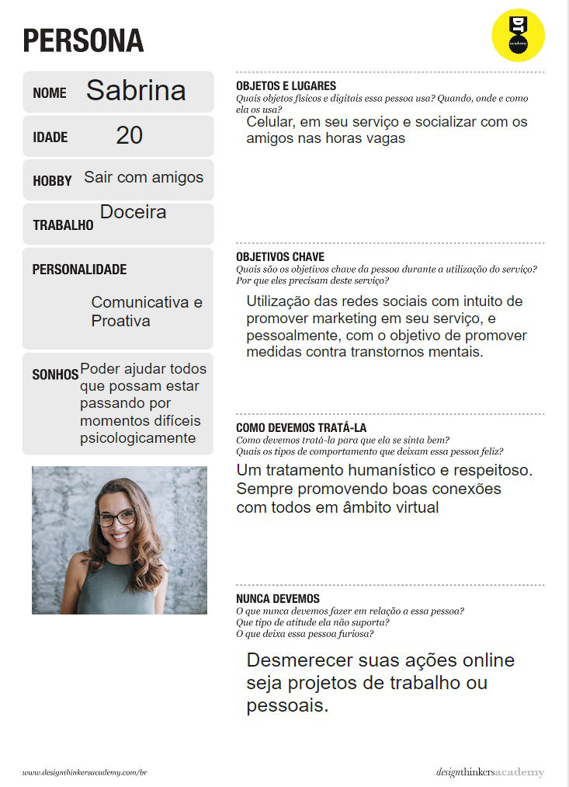
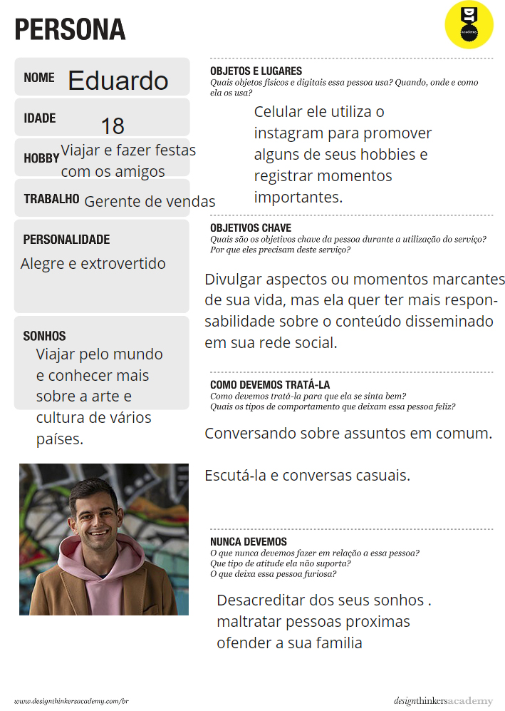
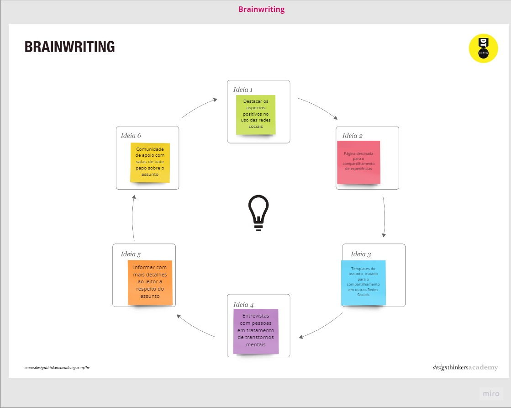
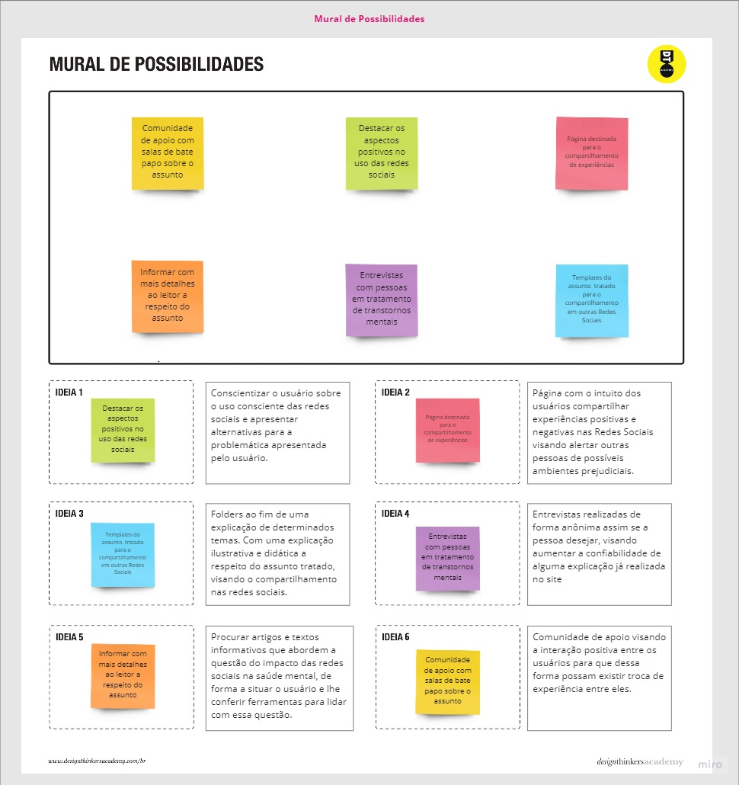
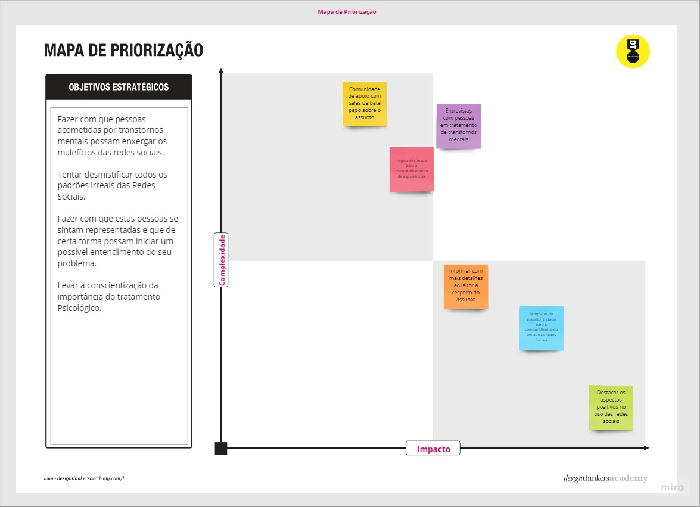

## Personas

Carla, tem 21 anos, e faz o uso constante das redes sociais em seu dia a dia, sendo elas, Instagram, WhatsApp e TikTok. Ela é diretamente afetada por grandes influencers e amigos do seu circulo social, com padrões irreais e a necessidade de aceitação dentro do seu grupo social.   Carla tem como seu principal objetivo, se aceitar fora dos padrões irreais e efetivar uma possível mudança de comportamento.

Mônica, tem 19 anos, e faz o uso das redes sociais apenas para distração ao longo do dia a dia, utilizando mais o Instagram.   Devido o muitas horas de uso das redes sociais de forma recreativa, Mônica teme estar negligenciando suas outras obrigações, como estudos, vida social, etc, e com isso acaba gerando ansiedade, no qual ela acaba se cobrando muito para recompensar o tempo perdido.   Mônica tem como objetivo, fazer com que cada vez mais a influencia das redes sociais diminua e além disso que ela possa tomar mais conhecimento dos efeitos negativos das redes.

Sabrina, tem 20 anos, e utiliza as redes sociais para promover o seu negócio e divulgar ações da igreja para o público jovem, ela participa da coordenação de eventos para jovens e acompanha de perto jovens e adultos acometidos por transtornos mentais, através da iniciativa "Força jovem".   Ao ser questionada, Sabrina explicitou a necessidade de conscientização da sociedade para com os transtornos mentais e disse ser interessante a criação de uma plataforma para promover ações e medidas de combate ao impacto das redes sociais na saúde mental e a prevenção de transtornos a ela associados.

Eduardo, tem 18 anos, e faz o uso de redes sociais em seu dia a dia, sendo a principal o Instagram. Eduardo faz o uso das redes sociais para postagem de seu estilo de vida e suas experiências. Eduardo tem consciência que apenas publica aspectos positivos de sua vida, como suas comidas prediletas, suas viagens, etc. Visto que, ao usar as redes sociais, ele planeja se sentir bem consigo mesmo.   Pois em sua concepção não faz sentido realizar postagens que o fariam mal, dessa forma,  Eduardo ressalta a importância de normalizar os aspectos negativos de sua vida, e não ficar preso a idealizações.

## Histórias de Usuários

<strong> Carla </strong>    
Eu, Carla, como usuária assídua  das redes sociais quero: Entender melhor a respeito dos padrões impostos pelas redes sociais
Ser menos influenciada pelos padrões de beleza e comportamento que me são impostos pelas redes sociais, para isso acredito ser necessário entender a extensão e o por quê dessa influência.
Motivo/valor: Se aceitar fora dos padrões irreais predominantes em âmbito virtual
Preciso me aceitar do jeito que eu sou, pois tentar me encaixar em um padrão me desgasta bastante e eu me sinto muito frustrada quando não consigo.

<strong> Mônica </strong>  

Eu, Mônica, como usuária casual das redes sociais quero entender até qual ponto o uso das redes sociais pode ser considerado um vicio
Entender se o tempo que gasto atualmente nas redes sociais pode me ser prejudicial de alguma forma, gostaria de dicas de como administrar melhor o meu tempo online, pois acredito que estou negligenciando outros aspectos da minha vida.
Motivo/valor: Tentar diminuir a influencia das redes sociais e buscar conhecimento quanto a seus impactos negativos
Não quero que as redes sociais sejam o meu único canal de entretenimento na minha vida, mas seu uso é vital para mim, pois me distrai a mente. Mas quero fazer uso consciente da mesma.

<strong> Sabrina </strong>  

Eu, Sabrina, como membro ativo da igreja e colaboradora do projeto “Força jovem” quero estudar mais a respeito do tema, para ajudar jovens dentro da temática 
Que essa questão dos transtornos mentais tenha mais visibilidade e que o os jovens tenham um espaço onde possam se informar e procurar ajuda. 
Motivo/Valor: Buscar novas abordagens e medidas de combate efetivas para seu projeto “Força Jovem”
Estamos nessa terra para ajudar aqueles que se encontram necessitados, e se temos meios para ajudar não devemos negligenciar nossa missão de amparo e servidão para com o próximo.

<strong> Eduardo </strong>  

Eu, Eduardo, como usuário constante das redes sociais e formador de opinião quero desmistificar essa ideia de que eu preciso provar algo para os outros por meio das redes sociais, pois me vem à mente que às vezes eu só quero provar algo para mim mesmo “Que eu estou bem, que eu tenho que estar bem.”
Motivo/Valor: Aceitar com mais naturalidade os aspectos negativos da minha vida, e não provocar em outras pessoas esse mesmo sentimento que também sinto às vezes de ter que aparentar estar bem o tempo todo, meio que propagando uma idealização de um padrão de vida irreal.

## BrainWriting

Em meio as metodologias de abordagem de soluções, fizemos o uso da técnica do BrainWriting na qual consiste em gerar ideias em grupo, na qual em um primeiro momento não é de suma importância que a ideia seja de extrema qualidade, mas ao longo da metodologia, ideias mais elaboradas surgem, ajudando assim a mentalizar arquiteturas de soluções ao projeto. Abaixo está um de nossos quadros de BrainWriting.

## Mural de Possibilidades

Após as ideias geradas no BrainWriting, fizemos o uso também do Mural de Possibilidades, no qual consiste em tratar as ideias obtidas no passo anterior, afim de detalhar e refinar de forma que possam ser utilizadas em uma possível solução. Confira abaixo nosso mural de possibilidades.

## Mural de Possibilidades

Após as ideias geradas no BrainWriting, fizemos o uso também do Mural de Possibilidades, no qual consiste em tratar as ideias obtidas no passo anterior, afim de detalhar e refinar de forma que possam ser utilizadas em uma possível solução. Confira abaixo nosso mural de possibilidades.

## Mapa de Priorização

Um dos últimos passos a ser feito em meio a metodologia do Design Thinking é o mapa de priorização, no qual, selecionamos as ideias de soluções agora já tratadas e definimos os objetivos estratégicos e quais são as melhores soluções a serem adotadas pelo grupo. Abaixo, temos nosso mapa de priorização.

### Requisitos Funcionais
|ID    | Descrição do Requisito  | Prioridade |
|------|-----------------------------------------|----|
|RF-001| O site deve conter matérias a fim de tratar e explicar os impactos negativos das redes sociais. | ALTA | 
|RF-002| O site deve destacar também os pontos positivos e boas práticas das redes sociais.   | ALTA |
|RF-003| O site deverá disponibilizar uma guia de relatos para que possam ser escritos relatos por pessoas acometidas de problemas advindo das redes sociais.   | ALTA |
|RF-004| O site deverá disponibilizar um sistema de login de usuário.   | ALTA |
|RF-005| O site deverá disponibilizar uma aba de favoritos para que o usuário possa salvar seus Artigos prediletos.   | ALTA |
|RF-006| Entrevistas com pessoas acometidas de transtornos mentais possivelmente derivados do uso das redes sociais, que estão sob e/ou precisam de orientação psicológica. | ALTA |
|RF-007| O site contará com o cadastro de artigos apenas para usuários com permissao de administradores | ALTA |
|RF-008| O site contará com uma aba para a exibição dos artigos salvos em favoritos | ALTA |
|RF-009| O site deve oferecer flyers para o compartilhamento de determinados assuntos com o uso de gráficos e resumo do assunto tratado para divulgação em meio as redes sociais.| Baixa |

### Requisitos não Funcionais

|ID     | Descrição do Requisito  |Prioridade |
|-------|-------------------------|----|
|RNF-001| O site deve ser responsivo para rodar em um dispositivos móvel | ALTA | 
|RNF-002| Deve processar requisições do usuário em no máximo 3s |  MÉDIA | 
|RNF-003| O site deve ser compatível com os principais navegadores do mercado |  MÉDIA |

## Restrições

O projeto está restrito pelos itens apresentados na tabela a seguir.

|  | Restrição                                             |
|--|-------------------------------------------------------|
|01| O projeto deverá ser entregue até o final do semestre |
|02| Não pode ser desenvolvido um módulo de backend        |

