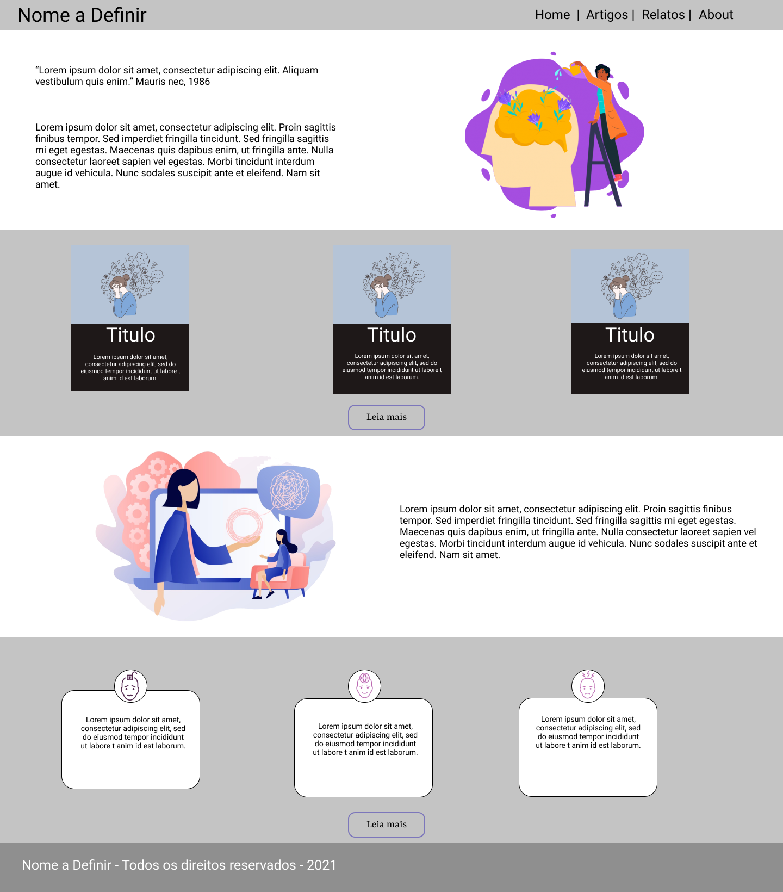
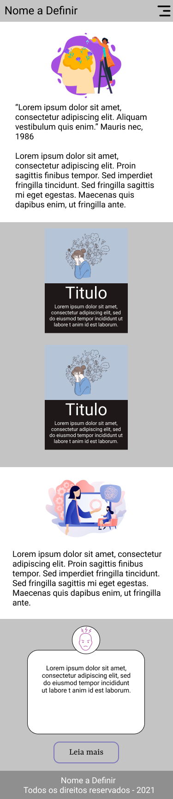
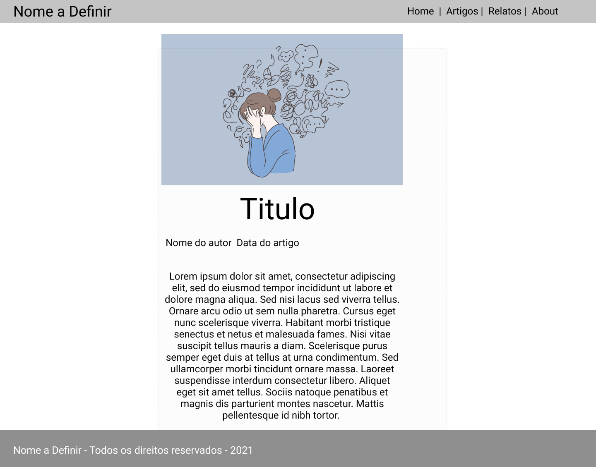
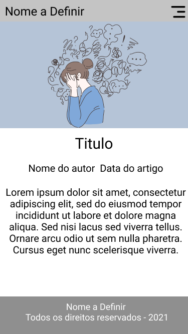
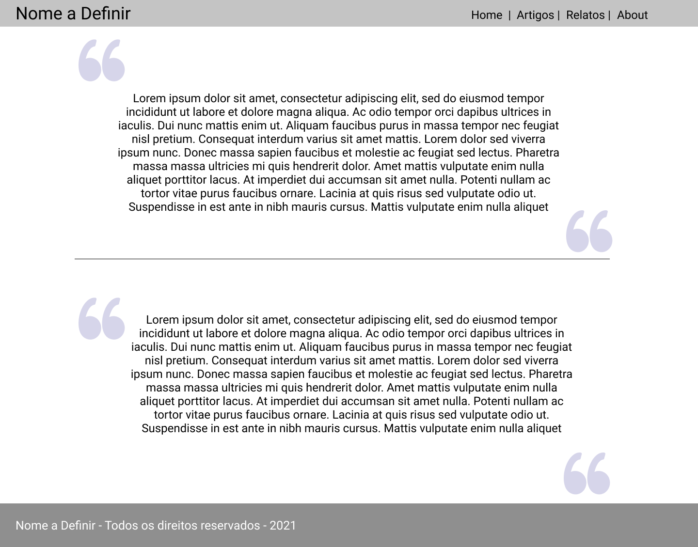
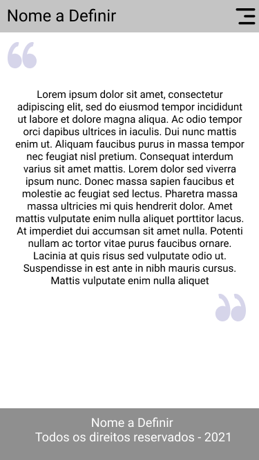

# Projeto de Interface

Pré-requisitos: <a href="2-Especificação.md"> Documentação de Especificação</a>

Uma de nossas principais preocupações é a montagem da interface do sistema, no qual estabelecemos como aspectos primordiais em sua utilização a objetividade, usabilidade e um design minimalista. De forma que, o projeto possa ser acessado em diferentes plataformas como desktop e dispositivos móveis.

## User Flow

> Fluxo de usuário (User Flow) é uma técnica que permite ao desenvolvedor
> mapear todo fluxo de telas do site ou app. Essa técnica funciona
> para alinhar os caminhos e as possíveis ações que o usuário pode
> fazer junto com os membros de sua equipe.
>
> **Links Úteis**:
> - [User Flow: O Quê É e Como Fazer?](https://medium.com/7bits/fluxo-de-usu%C3%A1rio-user-flow-o-que-%C3%A9-como-fazer-79d965872534)
> - [User Flow vs Site Maps](http://designr.com.br/sitemap-e-user-flow-quais-as-diferencas-e-quando-usar-cada-um/)

## Wireframes

Conforme podemos ver no fluxo de usuário no item acima, as telas apresentam uma estrutura comum, no qual abordaremos mais nos proximos items.
### Tela Home Desktop/Mobile

A Estrutura de nossa página de Home, já conta com a exibição prévia de alguns artigos e relatos presentes em nossa plataforma, e com um menu intuitivo e simples na parte superior do website. Em nossa estrutura mobile, contamos com as mesmas características da exibição em desktop, apenas utilizamos um menu em Dropdown para facilitar o acesso do usuário em uma plataforma mobile. 

### Tela Artigos Desktop/Mobile

A Estrutura de nossa página de artigos, conta com um wallpaper logo no inicio da notícia, os autores e todo o conteúdo, tendo como o menu, o mesmo apresentado na tela de Home em diferentes dispositivos.

### Tela Relatos Desktop/Mobile

A Estrutura de nossa página de relatos, conta com um relato de um individuo anônimo, entrevistado previamente, tendo o menu sendo o mesmo apresentado na tela de Home em diferentes dispositivos.

### Tela About Desktop/Mobile

A Estrutura de nossa página de About, conta com a exposição de todos os integrantes e desenvolvedores deste projeto

