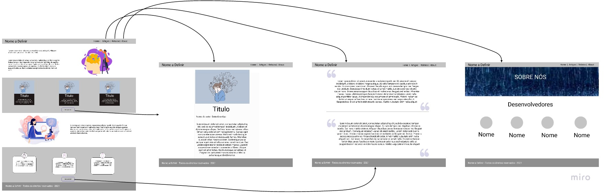
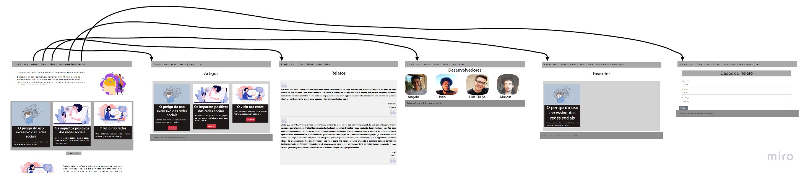
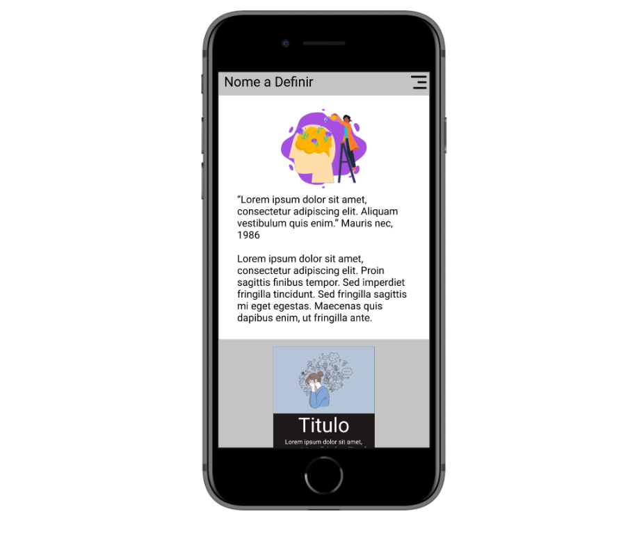
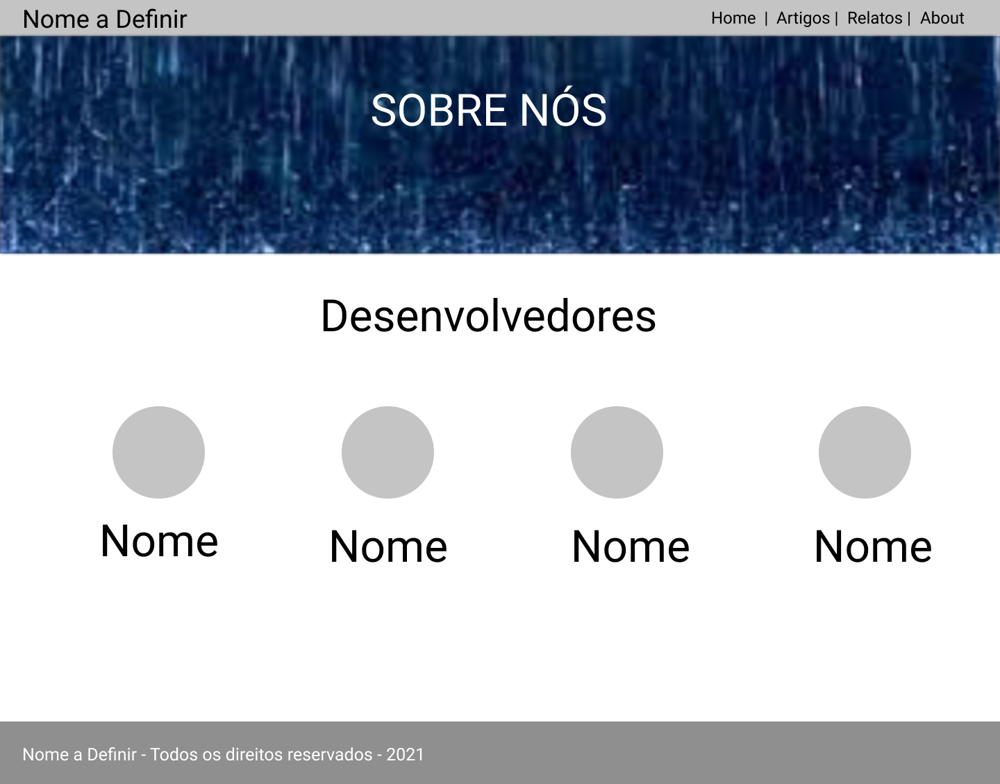
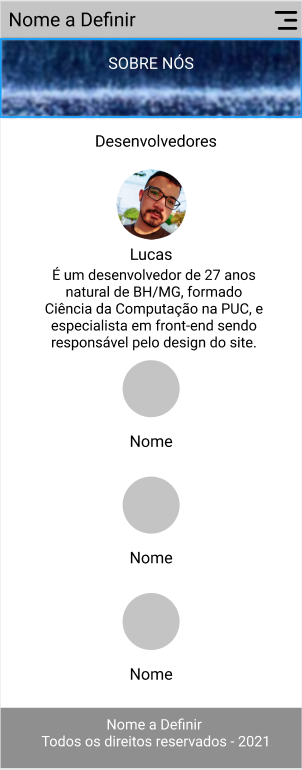

# Projeto de Interface

Pré-requisitos: <a href="2-Especificação.md"> Documentação de Especificação</a>

Uma de nossas principais preocupações é a montagem da interface do sistema, no qual estabelecemos como aspectos primordiais em sua utilização a objetividade, usabilidade e um design minimalista. De forma que, o projeto possa ser acessado em diferentes plataformas como desktop e dispositivos móveis.

## User Flow

Para o desenvolvimento do UserFlow utilizamos de diagramas para facilitar o entendimento do caminho no qual o usuário percorrera em meio a utilização de nosso site. Abordaremos com mais detalhes as telas apresentadas nos tópicos seguintes

UserFlow do projeto Final

## Protótipo Interativo

O protótipo interativo tem como intuito, demonstrar a utilização da plataforma. Para o teste do protótipo, basta acessar o seguinte link abaixo:
[Protótipo Interativo](https://www.figma.com/file/AzD61nVx76a678uOLQL8Mr/Impactos-negativos-das-redes-sociais?node-id=6%3A122).

## Wireframes

Conforme podemos ver no fluxo de usuário no item acima, as telas apresentam uma estrutura comum, no qual abordaremos mais nos proximos items.
### Tela Home Desktop/Mobile

A Estrutura de nossa página de Home, já conta com a exibição prévia de alguns artigos e relatos presentes em nossa plataforma, e com um menu intuitivo e simples na parte superior do website. Em nossa estrutura mobile, contamos com as mesmas características da exibição em desktop, apenas utilizamos um menu em Dropdown para facilitar o acesso do usuário em uma plataforma mobile. 

### Tela Artigos Desktop/Mobile

A Estrutura de nossa página de artigos, conta com um wallpaper logo no inicio da notícia, os autores e todo o conteúdo, tendo como o menu, o mesmo apresentado na tela de Home em diferentes dispositivos.

### Tela Relatos Desktop/Mobile

A Estrutura de nossa página de relatos, conta com um relato de um individuo anônimo, entrevistado previamente, tendo o menu sendo o mesmo apresentado na tela de Home em diferentes dispositivos.

### Tela About Desktop/Mobile

A Estrutura de nossa página de About, conta com a exposição de todos os integrantes e desenvolvedores deste projeto

