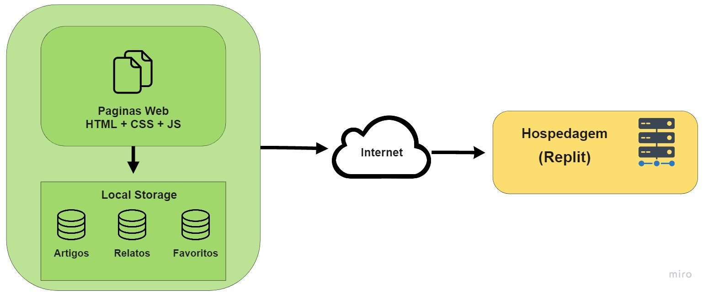

# Projeto da Solução

## Tecnologias Utilizadas

Em toda nossa plataforma utilizamos de HTML, CSS e JavaScript. Com as três ferramentas, conseguimos criar nossa plataforma de forma estável e intuitiva. Para hospedagem utilizamos a plataforma Replit. Abaixo, temos a visualização da arquitetura técnica de nosso projeto:

## Arquitetura da solução

A solução implementada conta com os seguintes módulos: 
*	Navegador - Interface básica do sistema  
* Páginas Web - Conjunto de arquivos HTML, CSS, JavaScript e imagens que implementam as funcionalidades do sistema. 
* Local Storage - armazenamento mantido no Navegador, onde são implementados bancos de dados baseados em JSON. São eles:  
  * Artigos - seções de artigos referentes ao tema  
  * Relatos - registro de relatos dos usuários referentes ao tema 
  * Favoritos - lista de relatos favoritos do usuário 
  * Login – informações de login e cadastro de usuário 
* Hospedagem - local na Internet onde as páginas são mantidas e acessadas pelo navegador.  
## Hospedagem
O site utiliza a plataforma do Replit como ambiente de hospedagem do site do projeto. O site é mantido no ambiente da URL:

## Templates de telas

Nossa plataforma obedece aos wireframes já apresentados e conta com as seguintes telas:  
*	Home  
*	Artigos  
*	Relatos  
*	Favoritos  
*	Cadastro de artigos (somente administradores)  
*	Cadastro de relatos  

Tendo todas as telas dispostas com a responsividade utilizando media queries e o sistema de colunas do boostrap

## Home
Tela inicial de nossa aplicação, que nos leva as demais áreas

## Tela Artigos
Tela de listagem de todos os artigos já cadastrados na plataforma

## Tela Relatos
Tela com todos os relatos já realizados em nossa plataforma

## Tela Favoritos
Tela que exibe os artigos que estão como favoritos em sua conta

## Tela Cadastro de Artigos
Tela para inserir dados para o cadastro de um novo artigo em nossa platafofrma, mas atenção, a plataforma s	o aceita usuários com permissão de administrador para inserir artigos na plataforma

## Tela Cadastro de Relatos
Tela para inserir seu relato respeitando a proposta da plataforma, bastando apenas estar logado na plataforma para inserir seu relato.

