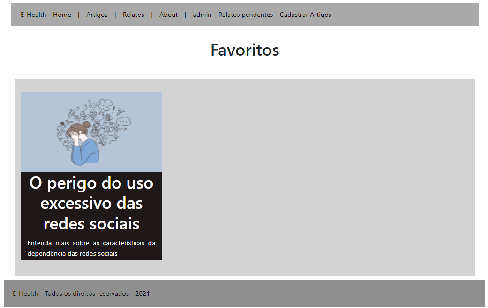

# Projeto da Solução

## Tecnologias Utilizadas

Em toda nossa plataforma utilizamos de HTML, CSS e JavaScript. Com as três ferramentas, conseguimos criar nossa plataforma de forma estável e intuitiva. Para hospedagem utilizamos a plataforma Replit. Abaixo, temos a visualização da arquitetura técnica de nosso projeto:

Confira nossa interface (Fluxo de usuário e Wireframes aqui)
[Projeto da Interface](3-Interface.md)

## Arquitetura da solução

A solução implementada conta com os seguintes módulos: 
*	Navegador - Interface básica do sistema  
* Páginas Web - Conjunto de arquivos HTML, CSS, JavaScript e imagens que implementam as funcionalidades do sistema. 
* Local Storage - armazenamento mantido no Navegador, onde são implementados bancos de dados baseados em JSON. São eles:  
  * Artigos - seções de artigos referentes ao tema  
  * Relatos - registro de relatos dos usuários referentes ao tema 
  * Favoritos - lista de relatos favoritos do usuário 
  * Login – informações de login e cadastro de usuário 
* Hospedagem - local na Internet onde as páginas são armazenadas e acessadas pelo navegador.  
## Hospedagem
O site utiliza a plataforma do Replit como ambiente de hospedagem do site do projeto. O site é mantido no ambiente da URL:
https://e-health.luis-fillipefil.repl.co/
## Templates de telas

Nossa plataforma obedece aos wireframes já apresentados e conta com as seguintes telas:  
*	Home  
*	Artigos  
*	Relatos  
*	Favoritos  
*	Cadastro de artigos (somente administradores)  
*	Cadastro de relatos  

Tendo todas as telas dispostas com a responsividade utilizando media queries, sistema de colunas do boostrap e interação com LocalStorage em todas as telas presentes em nossa plataforma, exibindo assim os relatos, artigos e favoritos de forma dinâmica.

## Home (RF04 e RF-09)
Alunos responsável: Marcus Vinicius
Tela pela qual poderia ser realizado o login e cadastro de um usuário em meio a plataforma.	
Entregue na Sprint 1 o login e na Sprint 2 o cadastro de usuário.

## Tela Exibição de Artigo (RF-01)
Alunos responsável: Luís Fillipe 
Tela pela qual é exibido a listagem com todos os relatos presentes no site, contando com a exibição única e simplificada de cada artigo. 
Entregue na Sprint 2.

## Tela Exibição de Relato (RF-03 e RF-06)
Alunos responsável: João Pedro 
Tela pela qual é exibido os relatos e detalhes das informações dadas no cadastro do relato. 
Entregue na Sprint 2.

## Tela Exibição Favoritos (RF-08)
Alunos responsável: Ângelo Gabriel 
Tela exibindo os artigos que foram salvos no favorito ao longo da navegação do site 
Entregue na Sprint 2.

## Tela Cadastro de Artigo (RF-01 e RF-07)
Alunos responsável: Luís Fillipe
Tela pela qual poderia ser realizado o cadastro de um artigo no site, tendo a exibição de modo paliativo, na mesma tela do cadastro.
Entregue na Sprint 1.

## Tela Cadastro de Relato (RF-03 e RF-06)
Alunos responsável: João Pedro
Tela pela qual poderia ser realizado o cadastro de um relato no site, tendo a exibição de modo paliativo, na mesma tela do cadastro.
Entregue na Sprint 1.

