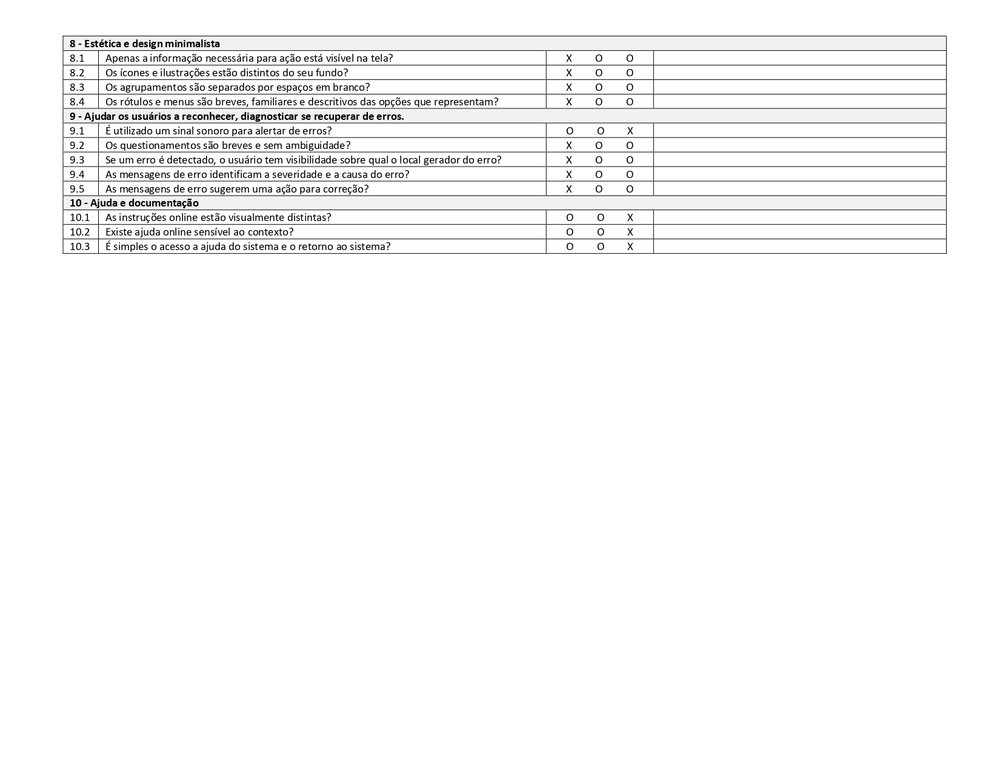

# Avaliação da Aplicação

Pré-requisitos: <a href="6-Implementação.md"> Projeto da Solução</a>

> Apresente os cenários de testes utilizados na realização dos testes da
> sua aplicação. Escolha cenários de testes que demonstrem os requisitos
> sendo satisfeitos.

## Plano de Testes

 Realizamos dois tipos de testes em nossa aplicação, uma Avaliação Heurística e também um plano
 de teste de software, utilizando como base os requisitos funcionais apresentados anteriormente. 
 Iremos detalhar inicialmente o plano de teste dos requisitos funcionais:
  ### Plano de teste requisitos funcionais
|Caso de Teste    | Requisitos Associados  | Objetivo do Teste | Passos | Critérios de Êxito|
|-----------------|------------------------|-------------------|--------|-------------------|
|CT-01 - Visualizar artigo|RF-01 - O site deve conter matérias a fim de tratar e explicar os impactos negativos das redes sociais. RF-02 - O site deve destacar também os pontos positivos e boas práticas das redes sociais.| Verificar se os artigos estão carregando corretamente | 1) Acessar o Navegador 2) Informar o endereço do Site 3) Entre na guia de artigos 4) Selecione um artigo para leitura |•	O artigo será carregado, trazendo consigo uma imagem, texto, autor e data. •	Os artigos devem trazer imagens visíveis associadas ao assunto do artigo
|CT-02 – Cadastrar Relato|RF-03 - O site deverá disponibilizar uma guia de relatos para que possam ser escritos relatos por pessoas acometidas de problemas advindo das redes sociais. RF-06 - Entrevistas com pessoas acometidas de transtornos mentais possivelmente derivados do uso das redes sociais, que estão sob e/ou precisam de orientação psicológica.| Cadastrar um relato para teste | 1) Acessar o Navegador 2) Informar o endereço do Site 3) Fazer o cadastro ou login na plataforma 4) Selecionar a opção de cadastro de relato 5)Cadastrar Relato |•	A página deve enviar o relato para os moderadores para que possa ser avaliado e decidido se deve ou não ser inserido no site
|CT-03 – Artigo Favorito|RF-05 - O site deverá disponibilizar a opção de salvar um arquivo como favorito, de forma que possam ser guardados em uma aba separada.| Salvar artigo como favorito | 1) Acessar o Navegador 2) Informar o endereço do Site 3) Fazer o cadastro ou login na plataforma 4) Ir ao menu de artigos  5)Clicar em favorita |•	A página deve mandar o artigo selecionado para uma nova página que deverá exibir os artigos que foram salvos em favoritos.
|CT-04 – Cadastrar Artigo|RF-07 - O site contará com o cadastro de artigos apenas para usuários com permissão de administradores.| Salvar artigo como favorito | 1) Acessar o Navegador 2) Informar o endereço do Site 3) Fazer o login na plataforma com usuário e senha de administrador (admin / admin) 4) Selecionar a opção de cadastro de artigo  5)Cadastrar artigo |•	A página deverá cadastrar o artigo e envia-lo de imediato para a exibição para os usuários da plataforma..

## Avaliação Heurística
 A avaliação Heurística é um tipo de tete pelo qual é  analisado a interface 
 a plataforma em questão, com perguntas predefinidas, no qual sao analisados
 questões de desing e usabilidade, sendo recomendada em qualquer etapa
 de construção do projeto.

## Avaliação

> Discorra sobre os resultados do teste. Ressaltando pontos fortes e
> fracos identificados na solução. Comente como o grupo pretende atacar
> esses pontos nas próximas iterações. Apresente as falhas detectadas e
> as melhorias geradas a partir dos resultados obtidos nos testes.
